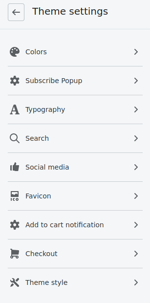

Create a new liquid file in your snippets folder called popup.liquid.
Add the following code to the file:

```
<script>
document.addEventListener("DOMContentLoaded", function () {
  let popupdisplayed = sessionStorage.getItem("popupdisplayed");
  let modal = document.querySelector("#modal-id");
  let overlay = document.querySelector("#overlay-id");
  let store = document.querySelectorAll(".setStorage");
  let initialFocus = document.querySelector("#close");
 
  
  if (popupdisplayed == "true") {
    modal.classList.remove("visible");
    overlay.classList.remove("visible");
  } else {
    modal.classList.add("visible");
    overlay.classList.add("visible");
    initialFocus.focus();
  }

  store.forEach((stored) => {
    stored.addEventListener("click", (e) => {
      sessionStorage.setItem("popupdisplayed", true);
      modal.classList.remove("visible");
      overlay.classList.remove("visible");
    });
  });
  document.querySelector("#Subscribe").addEventListener("click", (e) => { 
     sessionStorage.setItem("popupdisplayed", true);
//       modal.classList.remove("visible");
//       overlay.classList.remove("visible");
  });
  
  document.addEventListener("keydown", (e) => {
    if (event.keyCode == 27) {
      sessionStorage.setItem("popupdisplayed", true);
      modal.classList.remove("visible");
      overlay.classList.remove("visible");
    }
  });
});
  
  
  
   
</script>

<div class="subscribe-overlay setStorage" id="overlay-id"></div>
<div class="subscribe-modal" id="modal-id">
   <button type="button" id="close" class="closeBtn setStorage" data-dismiss="subscribe-modal" aria-label="Close"><span aria-hidden="true">Close</span></button>

    
  	<h1>{{settings.popup_title}}</h1>
    <p>{{settings.popup_message}}</p>
  
   
     
        <div class="form-message form-message--error">
          {{ form.errors | default_errors }}
        </div>
      
      
 		 <script>
//            let successFocus = document.querySelector("#close");
           sessionStorage.setItem("popupdisplayed", false);
//      	   successFocus.focus();
         </script>
         <p class="form-message form-message--success">Thanks for joining</p>
      
        <div class="">
          <input type="hidden" name="contact[tags]" value="newsletter">
          <input type="email"
            name="contact[email]"
            id="Email"
            class="input-group__field newsletter__input"
            value="{{ customer.email }}"
            placeholder="{{ 'general.newsletter_form.email_placeholder' | t }}"
            aria-label="{{ 'general.newsletter_form.email_placeholder' | t }}"
            
              aria-invalid="true"
            
            autocorrect="off"
            autocapitalize="off"
			required   
            autofocus>
          <span class="input-group__btn">
            <button type="submit" style="background:{{settings.button_color}};" class="btn newsletter__submit" stylename="commit" id="Subscribe">
              <span class="newsletter__submit-text--large">SIGN-UP</span>
            </button>
          </span>
        </div>
      
        
</div>
   
<style>
.subscribe-overlay {
  display: none;
  position: fixed;
  top: 0;
  left: 0;
  width: 100%;
  height: 100%;
  z-index: 50;
  background: rgba(0, 0, 0, 0.5);
} 
.subscribe-modal {
  --img-ratio: 3/2;
  display:none;
  width: max(20vw, 400px);
  max-width: 100%;
  max-height: 100%;
  background:white;
  position: fixed;
  z-index: 100;
  left: 50%;
  top: 50%;
  transform: translate(-50%, -50%);
  flex-direction: column;
  border-radius: 0.5rem;
}
.subscribe-modal > * + * {
  margin-top: 1rem;
}
.subscribe-modal > img {
  height: max(18vh, 12rem);
  object-fit: cover;
  width: 100%;
  margin-top: 0;
  border-radius: 0.5rem;
}
@supports (aspect-ratio: 1) {
  .subscribe-modal > img {
    aspect-ratio: var(--img-ratio);
    height: auto;
  }
}
.subscribe-modal > :not(img) {
  margin-left: 1rem;
  margin-right: 1rem;
}

.subscribe-modal > :last-of-type:not(img, h1, p, input) {
  margin-bottom: 1rem;
}

.subscribe-modal h1 {
  text-align: center;
  font-size:1.5rem;
}
   
.subscribe-modal p {
  text-align: center;
}
  
form > :first-child {
  margin-bottom: 0.5rem;}
input {
  width: 100%;
  border: none;
  background: hsl(0 0% 93%);
  border-radius: 0.25rem;
}

.closeBtn {
  position: absolute;
  z-index: 1000;
  top: 1rem;
  right: 0px;
  color: darkgray;
  padding: 5px 10px;
  font-size: 1.2em;
  border: none;
  background: rgba(255, 255, 255, 0);
  }

.closeBtn:focus,
.closeBtn:hover {
  outline: none;
  color: black;
}
  
.visible {
  display: flex;
  animation: fade-in 2s;
}

@keyframes fade-in {
  from {
    opacity: 0;
  }
  to {
    opacity: 1;
  }
}

</style>

```

Now you need to edit the code in the settings_schema.json file. It's located in your theme's config folder. The formatting of this file can be difficult, you can find Shopify's guidelines here: https://shopify.dev/docs/themes/settings

Adding this code will make the popup content customizable through the theme editor:

```
 {
    "name": {
      "en": "Subscribe Popup"
    },
    "settings": [
      {
        "type": "text",
        "id": "popup_title",
        "default": "Sign-up",
        "label": "Title"
      },
      {
        "type": "textarea",
        "id": "popup_message",
        "default": "Subscribe to our newsletter",
        "label": "Message"
      },
      {
        "type": "color",
        "id": "button_color",
        "label": "Button color",
        "default": "#ff4500"
      },
      {
        "type": "range",
        "id": "fadein",
        "min": 0,
        "max": 10,
        "step": 1,
        "unit": "sec",
        "label": "Time before popup to appear",
        "default": 4
      },
      {
        "type": "checkbox",
        "id": "home_page",
        "default": true,
        "label": "Show only on Home page"
      },
      {
        "type": "image_picker",
        "id": "popup_image",
        "label": "Select an image for the popup"
      }
    ]
  },
```

To make the popup content customizable in the theme editor.

Finally add the following code to your theme.liquid file. Place the code before the closing body tag </body>.

```
  
</body>
```

The popup should now appear in your customizable theme settings:



