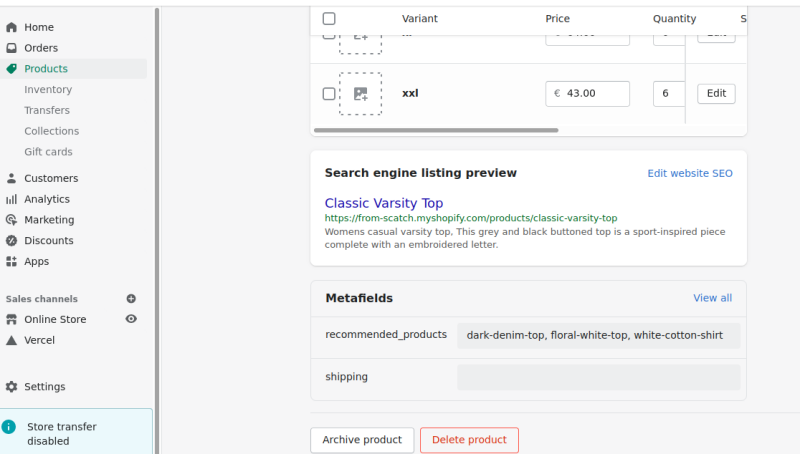

To choose your own recommended products for a particular product.

- Create a new Product metafield (Settings -> Metafields) .

- Give the metafield a name like `recommended_products` . Then it can be referenced in your liquid code as `{{ product.metafields.my_fields.recommended_products }}`

- Now, go to a product in the Shopify Admin and add a value for the new metafield. The value needs to be a comma seperated list of your chosen recommended product handles. The handle should be the product title, all lower case letters with hyphens instead of spaces, as it appears in the product page url, e.g. `dark-denim-top, floral-white-top, white-cotton-shirt, zipped-jacket`.



- Next, create a new section file called `custom-recommendations` and add the following code:

```



<div class="custom-products-wrapper page-width">
   <h3>Recommendations</h3>
    <ul class="custom-products-grid">
       
 	    
    	<li class="custom-products-grid-item">
           <a href="{{all_products[relatedProduct].url}}">
		   
           </a>
           <h3><a class="custom-products-a" href="{{all_products[relatedProduct].url}}">{{all_products[relatedProduct].title}}</a></h3>
           <p>{{all_products[relatedProduct].price | money }}</p>
        </li>
       
    </ul>
</div>

<style>

.custom-products-wrapper{
  margin: 1rem auto;
}
.custom-products-img {
  width: 100%;
}
.custom-products-grid {
  display: grid;
  grid-gap: 1rem;
  grid-template-columns: repeat(auto-fill, minmax(min(100%, 260px), 1fr));
  list-style: none;
  margin:0;
  padding: 0;
}
.custom-products-grid-item {
  display: flex;
  flex-direction: column;
  text-align: center;
}
.custom-products-a {
  text-decoration: none;
  color: black;
}

</style>


  {
    "name": "Custom Recommendations",
    "settings": []
  }


```

- Update the `product.json` template file (for Shopify 2.0 themes) to include the new `custom-recommendations` section. You can just add it to the end of the file and include it in the `order`; something like this:

```
    "product-recommendations": {
      "type": "product-recommendations",
      "settings": {
        "heading": "You may also like",
        "color_scheme": "background-1",
        "image_ratio": "square",
        "show_secondary_image": true,
        "show_vendor": false,
        "show_rating": false,
        "padding_top": 36,
        "padding_bottom": 28
      }
    },
    "custom-recommendations": {
      "type": "custom-recommendations",
      "settings": {
      }
    }
  },
  "order": [
    "main",
    "image-with-text",
    "multicolumn",
    "product-recommendations",
    "custom-recommendations"
  ]
}

```

Now you should see your custom product recommendations for any products where the `recommended _products` metafield has been populated.  

Here's how it looks on a test store using the Dawn theme: https://sunny-day-umbrellas.myshopify.com/products/beach-umbrella
